<<<<<<< HEAD
#  iTask - Sistema de Gestão de Tarefas (Kanban) 

O **iTask** é uma aplicação web interna para gestão de tarefas atribuídas aos programadores, baseada no conceito **Kanban**, com as listas clássicas: **"ToDo"**, **"Doing"** e **"Done"**. A aplicação permite uma gestão rigorosa das tarefas, promove a organização do trabalho em equipa e possibilita a análise estatística da produtividade.

---

## 📌 Índice

- [📝 Introdução](#-introdução)
- [🛠 Estrutura e Tecnologias](#-estrutura-e-tecnologias)
- [⚙️ Instalação e Configuração](#️-instalação-e-configuração)
  - [📊 Configuração da Base de Dados](#configuração-da-base-de-dados)
- [🚀 Como Iniciar o Projeto](#-como-iniciar-o-projeto)
- [✨ Funcionalidades e Páginas](#-funcionalidades-e-páginas)
  - [👥 Páginas Comuns](#-páginas-comuns)
    - [🔐 1. Login](#-1-login)
    - [👤 2. Perfil do Utilizador](#-2-perfil-do-utilizador)
    - [👨‍👩‍👧‍👦 3. Equipa](#-3-equipa)
    - [🚪 4. Terminar Sessão](#-4-terminar-sessão)
  - [👨‍💼 Páginas do Administrador (Gestor)](#-páginas-do-administrador-gestor)
    - [👥 5. Gestão de Utilizadores](#-5-gestão-de-utilizadores)
      - [📝 5.1 Pedidos de Alteração de Dados](#-51-pedidos-de-alteração-de-dados)
    - [📋 6. Gestão de Tarefas](#-6-gestão-de-tarefas)
    - [🏷️ 7. Tipos de Tarefas](#️-7-tipos-de-tarefas)
  - [👨‍💻 Páginas do Programador](#-páginas-do-programador)
    - [📊 9. Kanban (Homepage)](#-9-kanban-homepage)
    - [📝 10. Minhas Tarefas](#-10-minhas-tarefas)
- [👥 Créditos](#-créditos)

---

## 📝 Introdução

O sistema **iTask** permite a gestão completa de tarefas numa equipa de desenvolvimento, distinguindo dois perfis:

| Perfil | Responsabilidades |
| :----- | :---------------- |
| **Gestor (Administrador)** | Cria, edita e elimina tarefas; gere utilizadores; define tipos de tarefas; visualiza estatísticas e exporta relatórios. |
| **Programador** | Visualiza tarefas atribuídas; move tarefas entre colunas Kanban (respeitando regras de negócio); consulta tarefas concluídas com tempos de execução. |

> 🔐 **Credenciais de Acesso (Administrador/Gestor):**  
> **Username:** `Admin`  
> **Password:** `Admin123.`

---

## 🛠 Estrutura e Tecnologias

O projeto foi construído com as seguintes ferramentas:

| Categoria          | Tecnologias                                      |
| :----------------- | :----------------------------------------------- |
| **Frontend**       | React, TypeScript, HTML5, CSS3                   |
| **Backend**        | Python, FastAPI                                  |
| **Base de Dados**  | SQL Server                                       |

---

## ⚙️ Instalação e Configuração

### 📋 Pré-requisitos

- Node.js (v18+)
- Python (v3.10+)
- SQL Server (2019+)

### Configuração da Base de Dados

1. Abra o **SQL Server Management Studio (SSMS)**.
2. Abra o ficheiro `DBITask.sql` e execute para criar a base de dados.

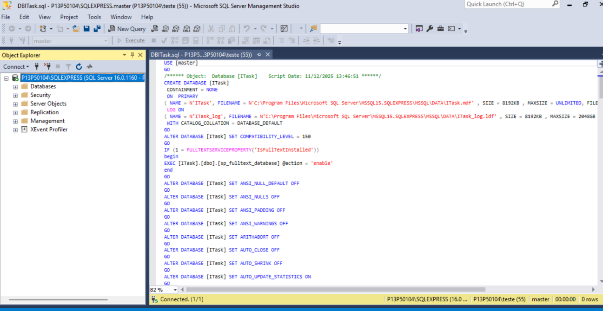

> **Nota:** Altere a string de ligação no ficheiro `Projeto LD\DDM_LD_D12BE-main\DDM_LD_D12BE-main` conforme a sua configuração.

### 🐍 Backend (FastAPI)

1. Abra o terminal e execute os seguintes comandos:

```bash
cd DDM_LD_D12BE-main
cd DDM_LD_D12BE-main
python -m uvicorn main:app --reload
```

Aceda a http://127.0.0.1:8000/docs para testar a API.

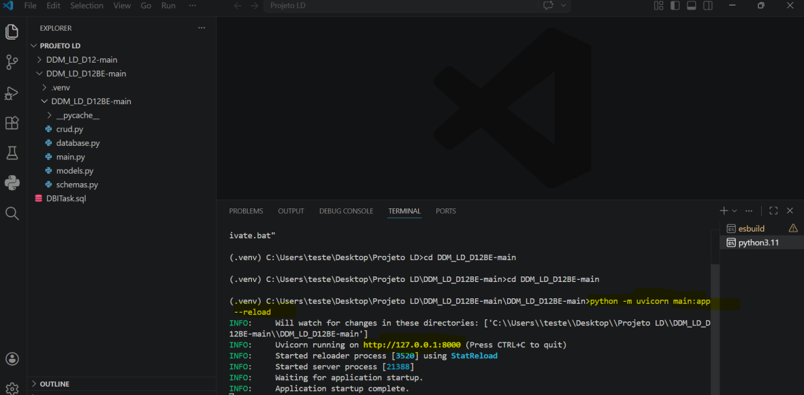

> **Nota:** Na imagem aparece apenas http://127.0.0.1:8000; deve adicionar `/docs` no browser.

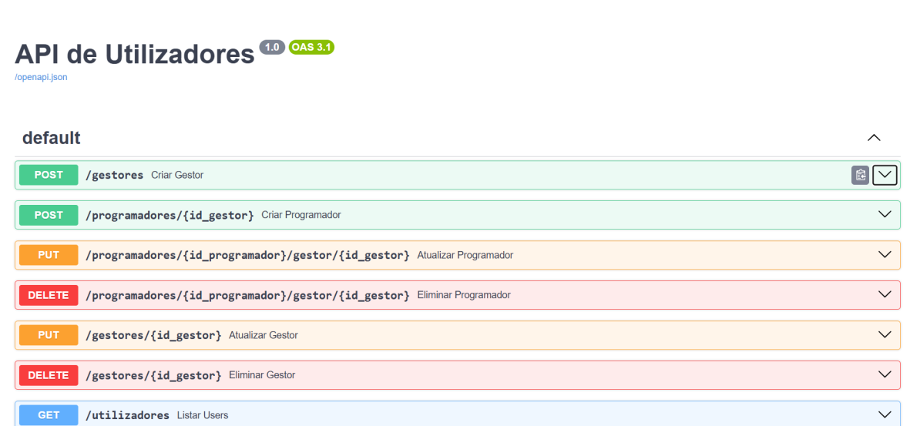

### ⚛️ Frontend (React)

1. Abra o terminal e execute os seguintes comandos:

```bash
cd DDM_LD_D12-main
cd DDM_LD_D12-main
npm run dev
```

Aceda a http://localhost:3000/ para testar a aplicação.

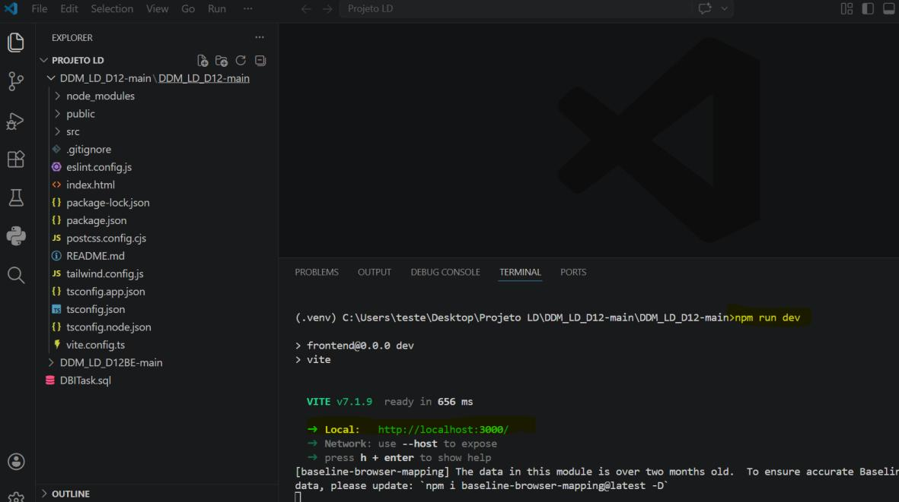

> **Nota:** A porta pode ser diferente (ex: 3000, 5173). Aceda à que o terminal indicar.

---

## 🚀 Como Iniciar o Projeto

1. Certifique-se de que a base de dados está configurada.
2. Inicie o backend FastAPI.
3. Inicie o frontend React.
4. Aceda à aplicação no browser.

---

## ✨ Funcionalidades e Páginas

### 👥 Páginas Comuns

### 🔐 1. Login

Ao aceder à página de login, deve introduzir o username e a password.

Se algum dos campos estiver em branco, o sistema solicitará que os preencha.

Caso o username não exista ou a password esteja incorreta, será informado de que as credenciais estão erradas.

Se os dados estiverem corretos, o sistema redireciona para a página Kanban correspondente ao perfil do utilizador.


#### 👤 2. Perfil do Utilizador

Nesta página, o utilizador autenticado pode visualizar todas as suas informações (nome, username, tipo, departamento, etc.).  
É aqui também que pode solicitar alterações aos seus dados pessoais.

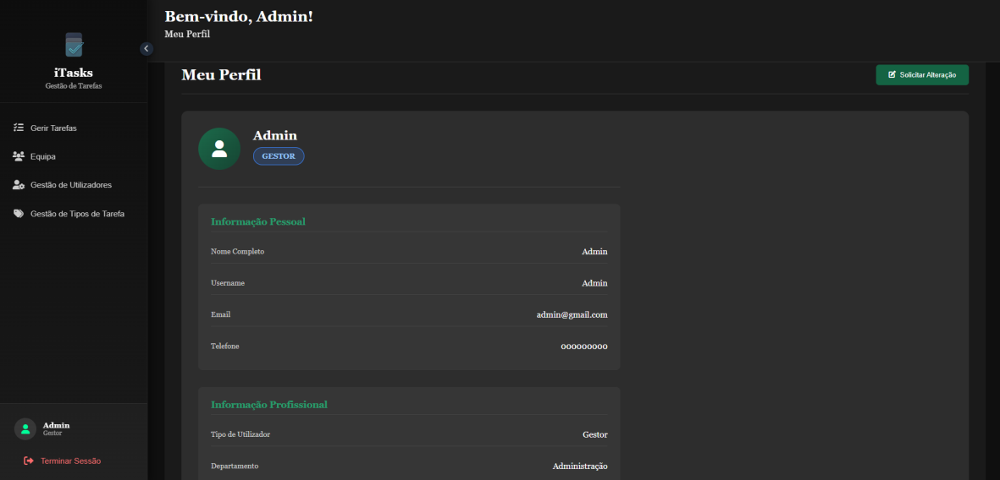

#### 👨‍👩‍👧‍👦 3. Equipa

**Visão do Gestor:**  
O gestor pode ver toda a sua equipa, incluindo os perfis de cada membro (programadores associados).
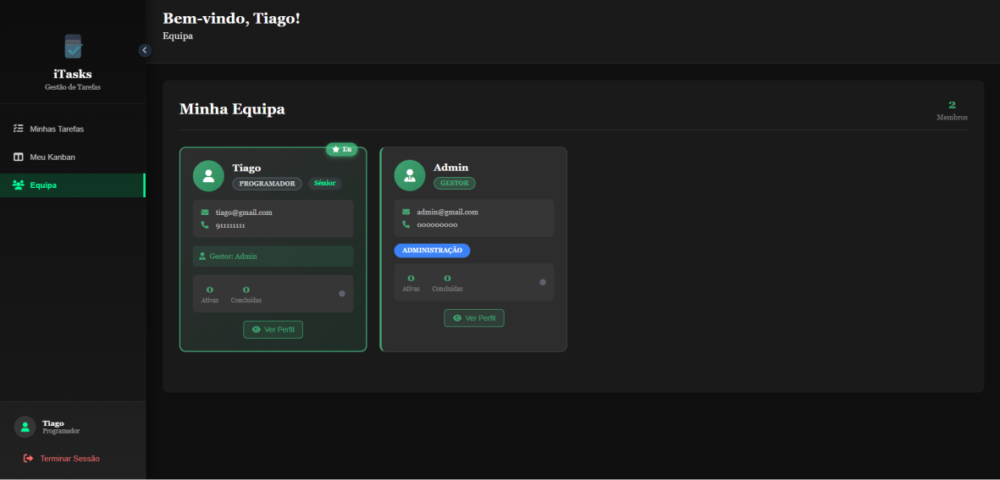

**Visão do Programador:**  
O programador pode ver os restantes membros da equipa, mas sem permissões de edição.

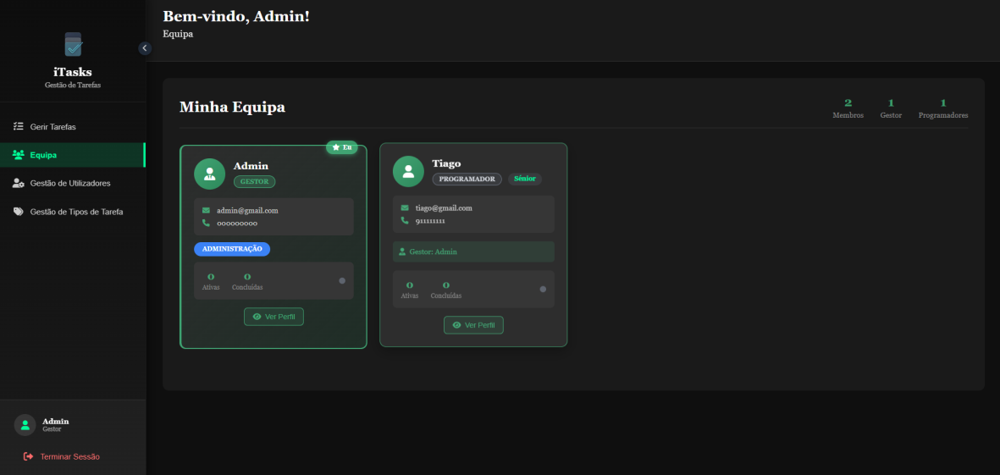

#### 🚪 4. Terminar Sessão

Para sair da conta autenticada, basta clicar no último item do menu lateral ou no canto superior direito, onde está escrito "Terminar sessão".

---

### 👨‍💼 Páginas do Administrador (Gestor)

#### 👥 5. Gestão de Utilizadores

Apenas utilizadores com perfil Gestor podem criar, editar ou eliminar utilizadores.

Campos obrigatórios:

- Username (único)
- Nome
- Password
- Tipo (Gestor/Programador)
- Nível de Experiência (Júnior/Sénior)
- Departamento (IT/Marketing/Administração)
- Gestor associado (apenas para Programadores)

Um gestor pode criar outros gestores ou programadores.  
Na tabela de utilizadores, existem botões de ação para editar e eliminar cada registo.

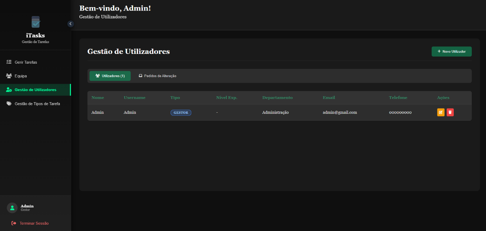

##### 📝 5.1 Pedidos de Alteração de Dados

Esta secção permite gerir os pedidos de alteração de informações pessoais dos programadores. Quando um programador deseja solicitar alterações aos seus dados pessoais (nome, departamento, nível de experiência, etc.), o pedido é submetido para aprovação do gestor.

**Funcionalidades:**

- Visualizar lista de pedidos de alteração pendentes
- Revisar dados alterados solicitados pelo programador
- Aceitar ou recusar pedidos de alteração
- Visualizar histórico de pedidos já processados
- Manter rastreabilidade de todas as mudanças

Esta abordagem garante um fluxo de trabalho controlado e seguro, permitindo que os gestores revisem e aprovem todas as mudanças de informações dos colaboradores de forma centralizada e rastreável.

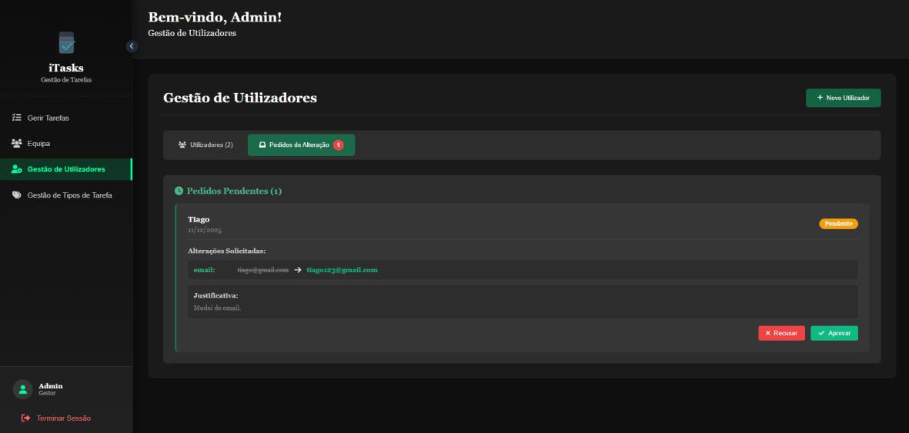

#### 📋 6. Gestão de Tarefas

Nesta secção, o gestor pode:

- Criar novas tarefas, associando apenas os seus programadores
- Editar tarefas existentes
- Eliminar tarefas
- Definir a ordem de execução das tarefas por programador
- Definir datas previstas de início e fim
- Visualizar o estado de cada tarefa (Por fazer, Em progresso, Concluído)

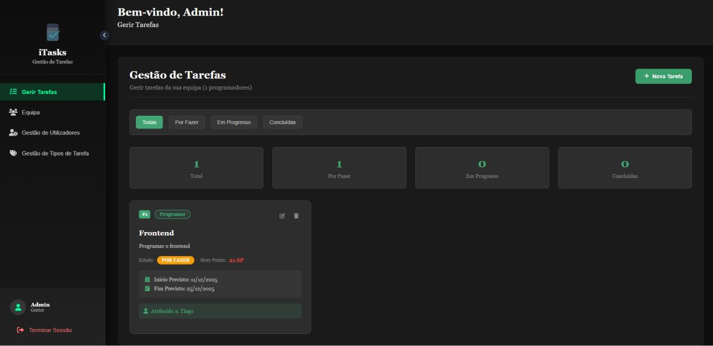

#### 🏷️ 7. Tipos de Tarefas

Apenas o gestor pode gerir os tipos de tarefas disponíveis no sistema:

- Criar novos tipos (ex: Bug, Feature, Melhoria)
- Editar tipos existentes
- Eliminar tipos
- Visualizar lista completa de tipos

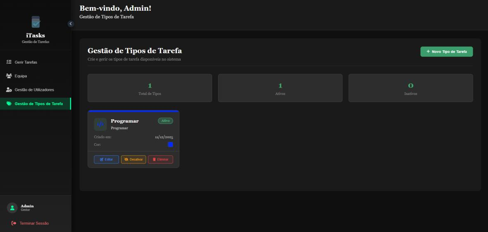


---

### 👨‍💻 Páginas do Programador

#### 📊 9. Kanban (Homepage)

Esta é a página principal após o login. Apresenta o quadro Kanban com três colunas:

- ToDo (Por Fazer)
- Doing (Em Progresso)
- Done (Concluído)

O nome do utilizador logado está visível no topo.

- Ver todas as suas tarefas
- Mover tarefas entre colunas (respeitando regras de negócio)
- Ver detalhes de qualquer tarefa (ícone "olhinho" no canto superior direito)

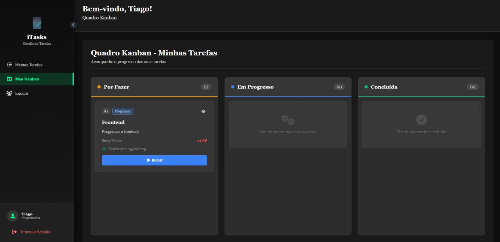

#### 📝 10. Minhas Tarefas

O programador tem uma página dedicada onde pode:

- Ver todas as suas tarefas numa lista
- Filtrar por: Todas, Por Fazer, Em Progresso ou Concluídas
- Ver o tempo que demorou em cada tarefa concluída

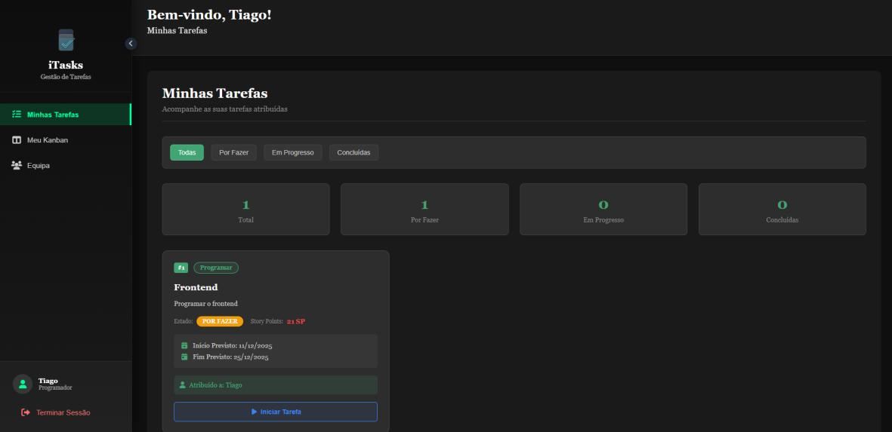

---

## 👥 Créditos

Projeto desenvolvido por:

- Jorge Castro - nº 2024454
- Tiago Felipe - nº 2024438

Turma: DDM


